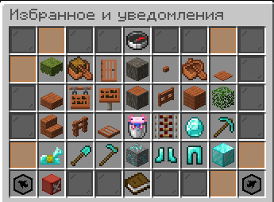
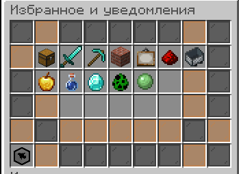
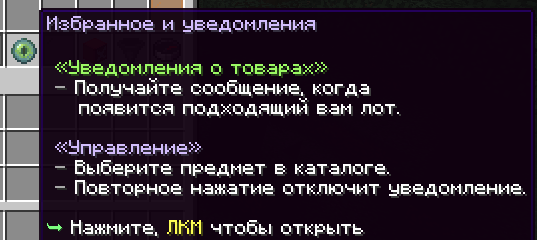
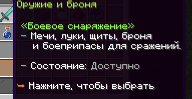

# pnMarket 1.0.3

Крупное обновление pnMarket с новым каталогом уведомлений, расширенной системой продажи, поддержкой нескольких экономик и полностью настраиваемым интерфейсом.

## Скриншоты

<table>
  <tr>
    <td align="center" width="50%">
      <strong>Каталог предметов</strong>  
      
    </td>
    <td align="center" width="50%">
      <strong>Категории уведомлений</strong>  
      
    </td>
  </tr>
  <tr>
    <td align="center" width="50%">
      
    </td>
    <td align="center" width="50%">
      
    </td>
  </tr>
</table>

## Добавлено

### Каталог уведомлений

- Добавлен отдельный GUI-каталог всех доступных предметов Minecraft.
- Добавлена полная русская локализация предметов, блоков, зелий, стрел и зачарований независимо от языка клиента.
- Предметы распределены по разделам: оружие и броня, инструменты, строительство, декорации, редстоун, транспорт, еда, зельеварение, ресурсы, яйца призыва и прочее.
- ЛКМ по предмету включает уведомления о каждом новом лоте выбранного типа.
- ПКМ открывает создание профиля с требованиями к зачарованиям.
- В один профиль можно добавить несколько обязательных зачарований и указать минимальный уровень каждого.
- Все выбранные зачарования проверяются одновременно на одном предмете.
- Показываются только зачарования, подходящие выбранному предмету. Несовместимые чары нельзя объединить.
- Добавлен отдельный экран активных уведомлений с просмотром и удалением профилей.
- Добавлены отдельные уведомления о новом лоте и снижении минимальной цены.
- В каталог включены обычные, усиленные и длительные зелья, взрывные и туманные варианты, а также стрелы со всеми эффектами.
- Уведомления и сообщения о продажах сохраняются для офлайн-игроков и показываются после входа на сервер.
- Команды `/ah notify` и `/dah notify` открывают каталог обычного или донат-аукциона.

### Продажа и лоты

- Добавлено перевыставление истёкшего лота по прежней цене из меню «Мои товары».
- Добавлена автоматическая оценка предмета через `/ah sell auto` на основе похожих активных лотов.
- Добавлены настраиваемые сроки жизни лотов для разных групп игроков с форматами `s`, `m`, `h`, `d`.
- Добавлена отключаемая комиссия отдельно за выставление и успешную продажу.
- Для групп привилегий можно задать разные проценты комиссии.
- Игрок видит размер комиссии при выставлении товара и сумму, полученную после продажи.

### Валюты и цены

- Добавлена поддержка ExcellentEconomy.
- Обычный и донат-аукцион можно независимо подключить к Vault, PlayerPoints или ExcellentEconomy.
- Каждую валюту можно отдельно включить или отключить.
- Добавлен ввод сокращённых чисел: `K`, `M`, `B`, `T`, `Q`.
- Добавлен выбор отображения цены: полное число (`1000000`) или сокращённое (`1M`).
- Формат валюты и обозначения числовых сокращений настраиваются в `config.yml`.
- Минимальную и максимальную цену лота можно указывать обычным или сокращённым числом.
- `/ah search` без текста выполняет поиск по предмету в основной руке игрока.

### Интерфейс

- Добавлены плавные анимации открытия и обновления GUI.
- Добавлен отдельный `gui.yml` для настройки названий, описаний, материалов и текстур кнопок.
- Добавлена настраиваемая разметка аукциона: количество строк, товарные слоты, декор и расположение управляющих кнопок.
- Добавлен игровой редактор `/pnmarket machine` для изменения разметки и иконок без ручного редактирования слотов.
- Добавлена панель `/pnmarket` с версией плагина, версией сервера, статусом обновления и ссылкой поддержки.

### Конфигурация

- Настройки перераспределены между компактными `config.yml`, `gui.yml` и `messages.yml`.
- Сообщения о покупке, продаже, выставлении и уведомлениях теперь настраиваются полноценными строками.

## Исправлено относительно предыдущей версии

- Исправлена слишком высокая и неравномерная громкость звуков интерфейса, покупки, продажи и ошибок.

## Обновление

1. Замените старый JAR на `pnMarket-1.0.3.jar`.
2. Установите новые `config.yml`, `gui.yml`, `messages.yml` и `lang/ru_ru.json` либо перенесите свои значения в новую структуру.
3. Полностью перезапустите сервер.
